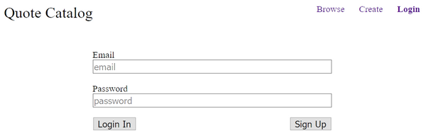
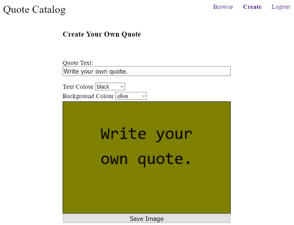
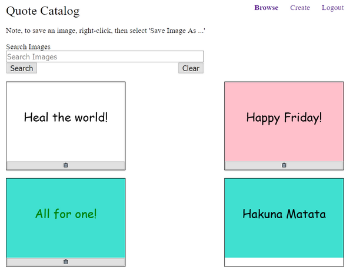
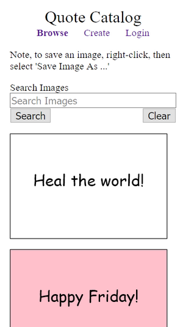

# Quote Catalog
This app allows users to manage a collection of images. Each image contains a quote. Users can create (and later delete) their own quotes. Users can also browse and search for quotes across all users of the application. Right-click on a quote to save it and post it to your social media.

## Technologies Used
The app was created using HTML, CSS, Javascript, MongoDB, Express, Node.js, and React. Additionally, [passport](http://www.passportjs.org/) was used to authenticate and track logged in users on the server, and [bcryptjs](https://www.npmjs.com/package/bcryptjs) was used for hashing user passwords.

## Usage
### Sign Up and Login
The first step is to create an account. Enter an email and password then click Sign Up. After successful Sign Up, use the same credentials to Login. (Alternatively, for demo purposes, you can use the following credentials: `guest@gmail.com` with password `guestGUEST`.)

> 

Once you're logged in, click on the `Logout` link in the navigation bar to log out.

### Create Quotes
Create your own quotes by clicking the `Create` link in the navigation bar. Only logged in users are allowed to create quotes.

Type the quote you wish to create in the text box. Use the drop down lists to change the text or background colours. Once you're happy with the preview image, click `Save Image` to save the image to the database.

> 

### Browse and Search Quotes
Click the `Browse` link in the navigation bar to view all the stored quotes. This page is also accessible to users who are not logged in. Right-click then `Save Image As ...` to save an image to your computer.

To search for an image by the text it contains, enter the search term in the search box and click `Search`. Images matching the query will be displayed. To clear the search results, click the `Clear` button. (Be aware that the MongoDB search feature ignores simple common words like 'the', 'and', and 'all', for example. So searches on these words won't return any results.) Also note, if you enter multiple words, you'll get results that match one or more of your search terms. Finally note, you can only search for whole words; the app doesn't check for parts of words.

> 

The app is also mobile-friendly.

> 

### Delete Quotes
From the `Browse` page you can also delete images, however you must be logged in to do so. For quotes you have created, you'll see a button with a delete icon below the image. Click on the button to delete the quote.

> 

## Setup
To run the app locally:
* Create a .env file in the same directory as server.js and add values for the following variables:
  * MONGODB_DB=quote_catalog
  * MONGODB_URI=
  * SECRET=
* Set the environment variable NODE_ENV=production
* `npm install`
* `npm build`

## Try It
You can view the deployed application [here](https://quote-catalog-62587.herokuapp.com/). As an alternative to creating your own account, you can use the following account: `guest@gmail.com` with password `guestGUEST`.
